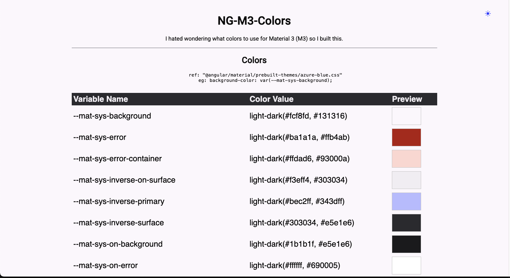
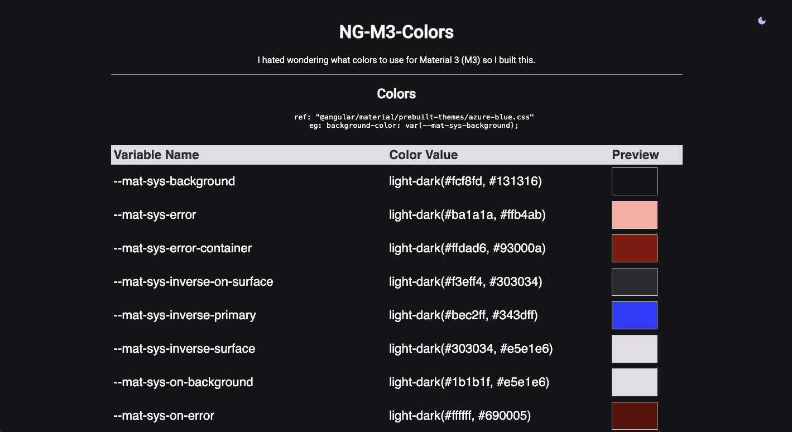

# Angular Material 3 (M3) Colors Showcase

This Angular application demonstrates all Material 3 (M3) system colors using CSS variables such as:

- `--mat-sys-background`
- `--mat-sys-error`
- `--mat-sys-error-container`
- `--mat-sys-inverse-on-surface`
- `--mat-sys-inverse-primary`
- `--mat-sys-inverse-surface`
- *(...and many more!)*

The app dynamically applies and displays each color, making it a useful reference for designers and developers working with Angular Material 3.

## 🚀 Features

- 🔥 **Full M3 color palette** – Every Material 3 color system variable is included.
- 🎨 **Live preview** – See how colors look and interact in real-time.
- 🌗 **Light/Dark mode toggle** – Easily switch between light and dark themes.
- 🏗 **Built with Angular** – Easy to extend and integrate into other projects.
- 📦 **Lightweight** – Minimal dependencies, making it fast and efficient.

## 📸 Screenshots

### Light Mode


### Dark Mode



## 📦 Installation & Setup

1. Clone the repository:

   ```sh
   git clone git@github.com:scottpreston/ng-m3-colors.git
   cd ng-m3-colors
   ```

2. Install dependencies:

   ```sh
   npm install
   ```

3. Ensure Angular Material is installed (required for M3 colors):

   ```sh
   ng add @angular/material
   ```

4. Run the development server:

   ```sh
   ng serve
   ```

5. Open your browser and navigate to:

   ```sh
   http://localhost:4200
   ```

## 🎯 Usage

- Browse through the app to view different Material 3 system colors.
- Click on colors to copy their variable names or HEX values.
- Toggle between light and dark mode using the UI switch.
- Modify or extend the theme in `styles.scss`.

## 🛠 Customization

You can tweak the color theme by modifying the `theme.scss` or `styles.scss` file. 
Example:

```scss
:root {
  --mat-sys-primary: #6200EE;
  --mat-sys-background: #F5F5F5;
}
```

To support dark mode, you can define alternate styles:

```scss
@media (prefers-color-scheme: dark) {
  :root {
    --mat-sys-background: #121212;
    --mat-sys-primary: #BB86FC;
  }
}
```

## 🤝 Contributing

Contributions are welcome! Feel free to submit issues or pull requests.

1. Fork the repository.
2. Create a new branch (`feature/my-new-feature`).
3. Commit your changes (`git commit -m 'Add some feature'`).
4. Push to the branch (`git push origin feature/my-new-feature`).
5. Open a Pull Request.

## 📜 License

This project is licensed under the MIT License - see the [LICENSE](LICENSE) file for details.

---

Happy coding! 🎨🚀